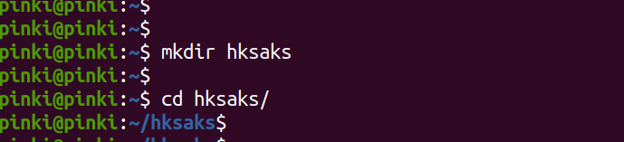
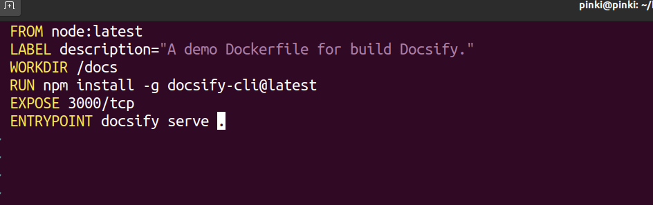
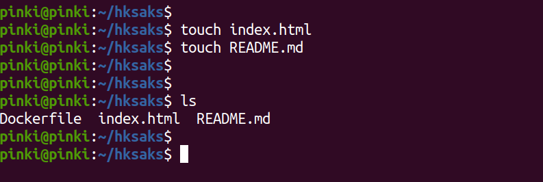
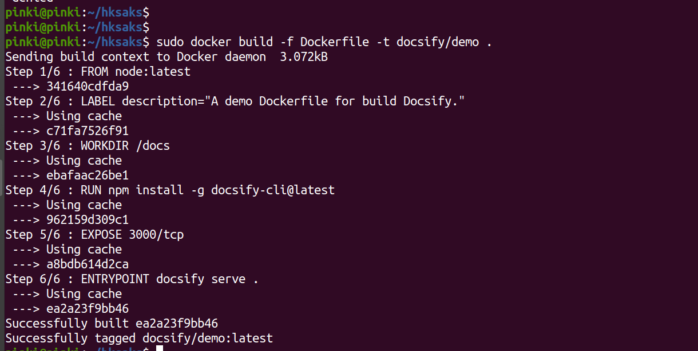
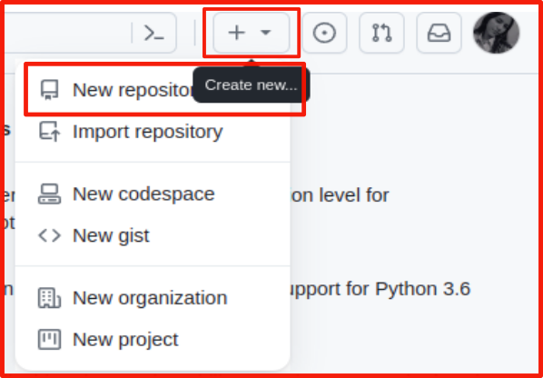
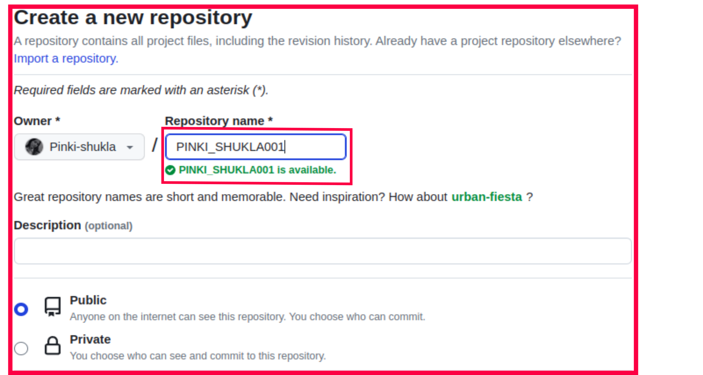
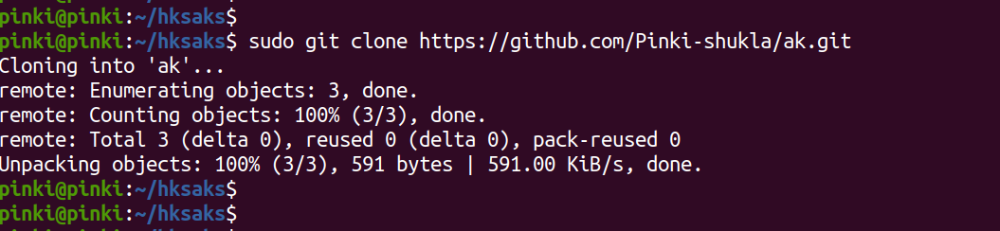

<center> <u> <h1 style="font-size: 50px;">Setup Docsify with Podman and Integrate with Github</center></h1> </u> </center><br>

## Linux Distribution

* OS Name : Ubuntu 20.04.6 LTS

## System Configuration

* RAM : 5.6 GiB
* CPU : 12
* STORAGE     : 512.1 GB
  

## Prerequisites tools
* Podman
* Github


## Docsify

<p>Docsify a popular documentation site generator. Docsify allows you to easily create documentation websites from simple Markdown files.
<p>Docify is a completely flexible tool that automates the preparation of recurring documents.</p>

<p>To use Docsify in Ubuntu, you'll need to follow these steps:</p>   

## Podman

Podman is an open-source container management tool that provides a way to manage containers on Linux systems. 

## GitHub

GitHub is a platform and cloud-based service for software development and version control using Git, allowing developers to store and manage their code. 


## Step 1:- Install Podman:
```
sudo apt -y install podman
```
<p> command is used to install Podman, on a Linux system.</p>

## Step 2:- Create a documentation directory:
```

mkdir hksaks
```

<p> We use "mkdir" command for creating the directory.</p>



## Step 3:-Create Dockerfile:
```
vim Dockerfile
```

<p>The content you've provided is a Dockerfile. A Dockerfile is a script that contains a set of instructions for building a Docker image. Each line in a Dockerfile represents a step in the image-building process.</p>

- <p><b>FROM node:latest:</b> It uses the official Node.js image with the "latest" tag, which means it will use the latest available version of Node.js as the base for your image.</p><br>

- <p><b>LABEL description="A demo Dockerfile for building Docsify.":</b> This line adds metadata to your image in the form of a label. Labels are used to provide additional information about the image. In this case, it describes the purpose of the Dockerfile, which is to build Docsify.</p><br>

- <p><b>WORKDIR /docs:</b> This line sets the working directory inside the container to /docs. </p><br>


- <p><b>RUN npm install -g docsify-cli@latest:</b> This instruction runs a command inside the container. It uses npm (Node Package Manager) to install the docsify-cli package globally. This package is required to run Docsify..</p><br>

- <p><b>EXPOSE 3000/tcp: </b>This instruction declares that the container will listen for incoming network connections on port 3000.</p><br>

- <p><b>ENTRYPOINT docsify serve .:</b> This instruction specifies the command that should be executed when a container is started from this image. It tells the container to run docsify serve ., which starts the Docsify server, serving documentation from the current directory (.).</b></p><br>




## Step 4:-Create  file:
```
touch index.html
```


```
touch README.md
```


<p>By using this command  create file in directory.</p>



##  Step 5:-Build docker image:


```
docker build -f Dockerfile -t docsify/demo .
```
<p>The command you provided, docker build -f Dockerfile -t docsify/demo ., is used to build a Docker image from a Dockerfile.</p>



 
```
podman images
```
<p>This command provides information about the images you have downloaded or built using Podman, including details such as the repository, tag, image ID, and size.</p>


## Step 6:-Podman run :
```
  podman run -itp 3000:3000 --name=docsifya -v /home/pinki/hksaks:/docs docsify/demo 
```

<p> The podman run command is used to run containers in Podman </p>


 


## Step 7:-Output of the Preview :
<p>Run docsify on localhost </p>


# <u>Github </u>

## Step 1:-For making a new repository, click on "+" icon:

)

## Step 2:-Enter your repository name and give permission to the public.



## Step 3:- Clone the git repository
```
git clone https://github.com/username/repository.git
```
<p>The git clone command is used in Git version control to create a copy of a remote Git repository on your local machine.</p>

<P> Replace username with the owner's GitHub username and repository with the name of the repository. You can obtain the URL from the repository's GitHub page or another Git hosting service.</P>



## Step-4 In this step, you need to follow the command that is provided by the github repository:

<p>Follow each commands to copy and paste.</p>


The git init command is used to initialize a new Git repository in a directory on your local machine. When you run git init in a directory, it sets up the necessary files and directories that Git uses to manage version control for your project.</p>

Git Repository: A Git repository is a version control system that allows you to track changes in your files and collaborate with others on software development projects. It stores a history of changes made to files in your project, making it easy to manage and track revisions.
```

git init

```


<p> When you make changes to your files, such as editing or adding new content to README.md, you need to use git add to inform Git that you want to include these changes in the next commit</p>

```
git add README.md

```

<p>The command git commit -m "first commit" is used to save or record changes to the repository, describing the changes you've made.</p>

```
git commit -m "first commit"
```


<P>The git branch -M main command is used to rename the default branch of your Git repository. This command is commonly used to change the name of the default branch from master to main.<P>

```
git branch -M main
```

<P>The git remote add origin command is used to connect your local Git repository with a remote repository on a platform like GitHub. The origin in this command is typically a short name used to refer to the remote repository.</P>

```
git remote add origin https://github.com/Pinki-shukla/docsify001.git
```
<P>The git push -u origin main command is used to push the local commits in your repository's main branch to the remote repository specified by the origin remote. The -u flag is used to set up tracking between the local main branch and the remote main branch, making it easier to push and pull changes in the future.</P>


```
git push -u origin main
```


